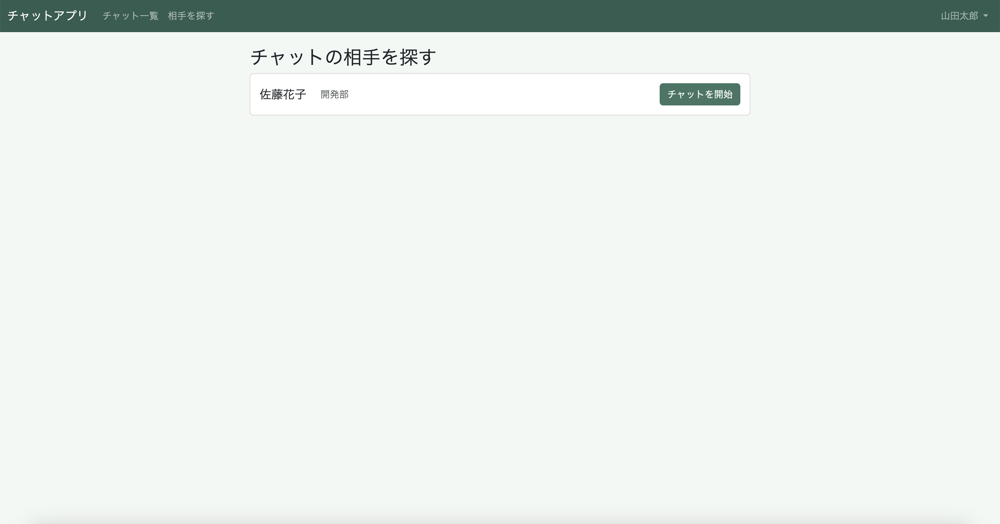
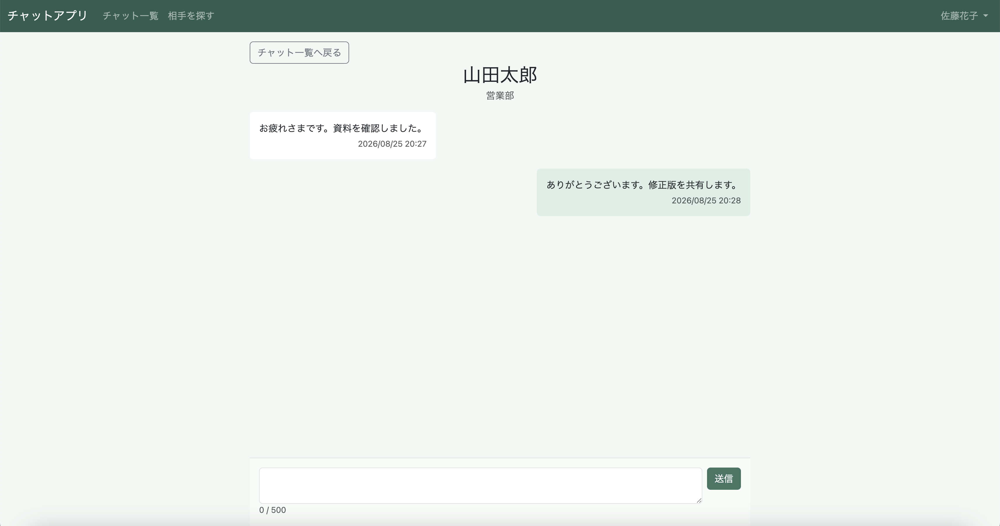
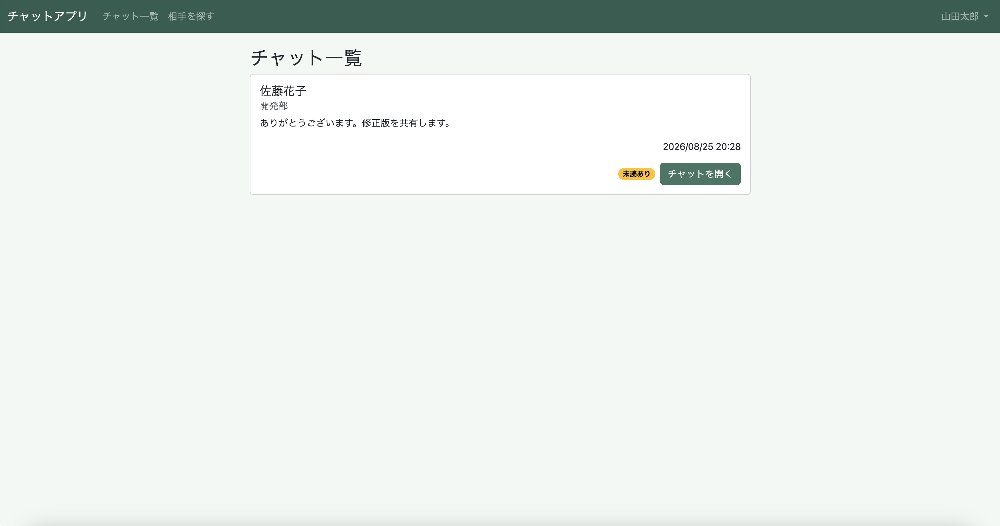
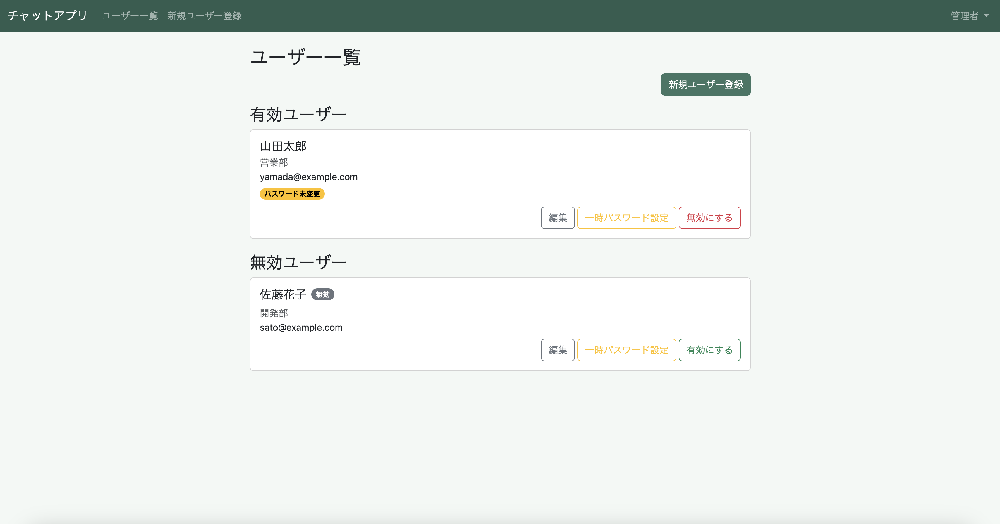
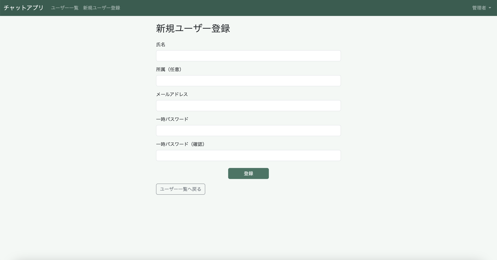
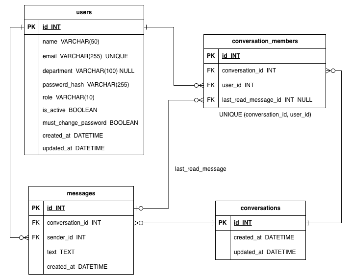
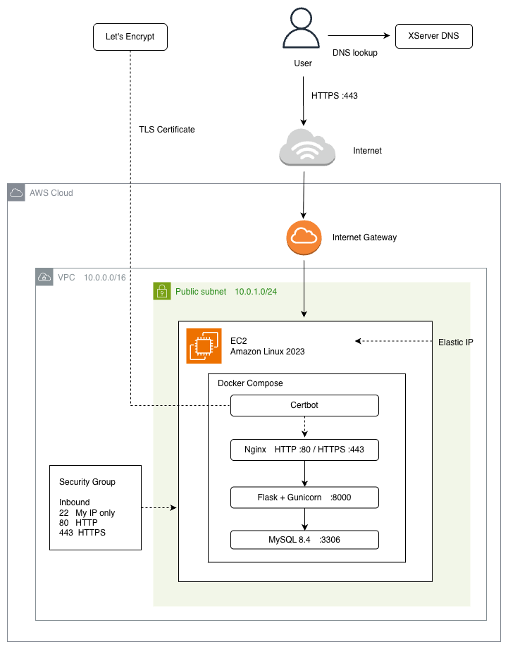

# flask-chat-app

## 目次
- [アプリ概要](#アプリ概要)
- [制作目的・背景](#制作目的・背景)
- [主な機能](#主な機能)
- [画面・スクリーンショット](#画面スクリーンショット)
- [使用技術](#使用技術)
- [ER図](#er図)
- [AWS構成図](#aws構成図)
- [インフラ・デプロイ構成](#インフラデプロイ構成)
- [セキュリティ対策](#セキュリティ対策)
- [工夫したこと](#工夫したこと)
- [開発プロセス](#開発プロセス)
- [ローカルでの起動方法](#ローカルでの起動方法)
- [今後の改善点](#今後の改善点)

## アプリ概要
Flaskを使用して制作した、1対1のチャットアプリです。
管理者によるユーザー登録・管理機能、ログイン機能を備え、一般ユーザー同士でチャットを開始し、メッセージを送受信できます。
また、初期パスワードが未変更の場合や未読メッセージがある場合にはバッジを表示します。

## 制作目的・背景
以前Flaskを使用してTODOアプリを制作したため、次のステップとして、複数ユーザー間でデータをやり取りする、より複雑なWebアプリケーションの開発に取り組みたいと考えました。

また、文法を学習していたJavaScriptを実際のアプリケーションで使用し、メッセージの送受信や画面の自動更新を実装することで、ブラウザとサーバー間でデータをやり取りする仕組みへの理解を深めることも目的としました。

さらに、アプリケーションの実装だけでなく、Dockerによる環境構築、AWS EC2へのデプロイ、Nginxの導入、独自ドメインの設定、HTTPS化までを実践し、Webアプリケーションを開発して公開するまでの一連の流れを経験することを目標としました。

これらの技術を個別に学習するだけでなく、実際に一つのアプリケーションを制作・公開する中で組み合わせて使用することで、理解を深めることを意識しました。

## 主な機能

### 管理者
- ユーザー登録
- ユーザー情報の編集
- ユーザーの有効化・無効化
- 一時パスワードの再設定（パスワード初期化）

### 一般ユーザー
- チャット可能なユーザーの一覧表示
- 1対1チャットの開始
- メッセージの送受信
- チャット一覧の表示
- 未読メッセージのバッジ表示
- パスワード未変更時のバッジ表示
- パスワード変更

### 共通
- ログイン
- ログアウト

## 画面・スクリーンショット

### 一般ユーザー

#### チャットの相手を探す



有効な一般ユーザーの一覧を表示し、選択したユーザーとのチャットを開始できます。

#### チャット画面



1対1でメッセージを送受信できます。各メッセージには送信日時を表示し、1回に送信できるメッセージは500文字までに制限しています。

#### チャット一覧



参加しているチャットを一覧表示し、選択したチャットを開くことができます。相手の名前、最新メッセージ、最終更新日時を表示し、未読メッセージがある場合は「未読あり」バッジを表示します。

### 管理者

#### ユーザー一覧



登録ユーザーを一覧表示し、アカウントの有効化・無効化を行えます。初期パスワードが未変更のユーザーにはバッジを表示します。また、新規ユーザー登録、ユーザー情報の編集、一時パスワード設定の各画面へ移動できます。

#### 新規ユーザー登録



管理者がユーザー情報と一時パスワードを設定し、一般ユーザーのアカウントを新規登録できます。

## 使用技術

### バックエンド

- Python 3.11
- Flask 3.1
  - Webアプリケーションの構成を整理するため、Blueprintを使用して機能ごとに処理を分割しました。
- Flask-SQLAlchemy 3.1
  - ORMを利用したデータベース操作に使用しました。
- Flask-Migrate 4.1
  - データベーススキーマの変更管理に使用しました。
- Flask-Login 0.6
  - ログイン状態の管理や認証機能の実装に使用しました。
- Flask-WTF 1.3
  - フォームのCSRF対策に使用しました。
- Gunicorn 26.1
  - 本番環境でFlaskアプリケーションを実行するWSGIサーバーとして使用しました。

### データベース

- MySQL 8.4

### フロントエンド

- HTML
- CSS
- Bootstrap 5.3
- JavaScript
  - fetch APIを使用したメッセージの非同期送受信と、定期的なメッセージ取得を実装しました。

### 開発環境

- macOS
- Docker / Docker Compose
  - 開発環境および本番環境のコンテナ構成に使用しました。

### インフラ・デプロイ

- AWS EC2
- Amazon VPC
- Elastic IP
- Security Group
- Nginx
  - リバースプロキシとして使用しました。
- Let's Encrypt / Certbot
  - SSL/TLS証明書の取得・自動更新に使用しました。
- XServer DNS
- HTTPS

### 開発・バージョン管理

- Git
- GitHub
- VS Code

## ER図

ユーザーと会話の関連付けを`conversation_members`で管理し、`last_read_message_id`を用いて未読メッセージを判定しています。



## AWS構成図

AWS EC2上にDocker Composeを用いて本番環境を構築し、独自ドメイン・HTTPSで公開しています。



## インフラ・デプロイ構成

本番環境はAWS EC2上に構築し、EC2インスタンスをVPC内のPublic Subnetに配置しています。固定のパブリックIPアドレスとしてElastic IPを割り当て、Security Groupによって外部からの通信を制御しています。

EC2上ではDocker Composeを使用し、Nginx、Flask + Gunicorn、MySQL、Certbotをコンテナで構成しています。外部からのHTTPSリクエストはNginxで受け、リバースプロキシとしてGunicornで動作するFlaskアプリケーションへ転送しています。

独自ドメインのDNS管理にはXServer DNSを使用し、ドメインをElastic IPへ向けています。また、Let's Encrypt / Certbotを使用してSSL/TLS証明書を取得し、証明書の自動更新を設定しています。

## セキュリティ対策

- **認証・認可**
  - Flask-Loginを使用してログイン状態を管理し、`@login_required`によって未ログインユーザーからのアクセスを制限しています。
  - 管理者・一般ユーザーの権限を分けるとともに、チャット画面では参加者であることを確認し、参加していないユーザーが他のユーザーの会話を閲覧できないようにしています。

- **パスワードのハッシュ化**
  - パスワードは平文で保存せず、ハッシュ化してデータベースに保存しています。

- **CSRF対策**
  - Flask-WTFのCSRFProtectを使用しています。通常のフォームに加え、JavaScriptからPOSTリクエストを送信する処理でもCSRFトークンを送信しています。

- **秘密情報の環境変数による管理**
  - `SECRET_KEY`やデータベース接続情報などを`.env`で管理し、`.gitignore`によってGitの管理対象から除外しています。

- **SQLAlchemy ORMの利用**
  - データベース操作にはSQLAlchemy ORMを利用し、SQLを文字列結合して直接組み立てないようにしています。

- **本番環境の通信・アクセス制御**
  - HTTPSに対応し、通信を暗号化しています。また、Security Groupで外部からの通信を制御し、MySQLをインターネットへ直接公開しない構成としています。

## 工夫したこと

### ユーザーの役割分担
管理者と一般ユーザーで利用できる機能を分け、管理者はユーザー管理、一般ユーザーはチャットを利用する構成としました。

### 状態を分かりやすくする表示
未読メッセージや初期パスワード未変更の状態をバッジで表示し、必要な対応を確認しやすくしました。

### 機能ごとの処理の分割
アプリケーションの機能が増えたため、Blueprintを使用して認証・管理者・チャットなどの処理を分割しました。

## 開発プロセス

### 開発の進め方
仕様・画面・データベース構成を整理したうえで、機能ごとに実装と動作確認を進めました。

チャット機能では、まず通常のフォーム送信によるメッセージ送信を実装し、その後JavaScriptの`fetch`を用いた非同期送受信、定期的なメッセージ取得へと段階的に機能を追加しました。

アプリケーションの実装後は、Docker Composeを用いて本番環境を構築し、AWS EC2へのデプロイ、独自ドメインの設定、Nginxの導入、HTTPS化までを行いました。

## ローカルでの起動方法

### 前提条件

- Docker / Docker Compose
- Git

### 1. リポジトリをクローン

```bash
git clone https://github.com/mikan49-iy/flask-chat-app.git
cd flask-chat-app
```

### 2. 環境変数を設定

`.env.example`をコピーして`.env`を作成します。

```bash
cp .env.example .env
```

`.env`内の`SECRET_KEY`やパスワード等を、ローカル環境用の値に変更してください。

### 3. コンテナを起動

```bash
docker compose up -d --build
```

### 4. データベースを準備

```bash
docker compose exec web flask --app run:app db upgrade
```

### 5. 初期管理者を作成

```bash
docker compose exec web flask --app run:app create-admin
```

表示される案内に従って、管理者名・メールアドレス・パスワードを入力します。

### 6. アプリケーションへアクセス

ブラウザで`http://localhost:5000`にアクセスします。

作成した管理者アカウントでログイン後、一般ユーザーを登録して利用できます。

## 今後の改善点

- **リアルタイム通信への発展**
  - 現在はJavaScriptの`fetch`を使用して定期的にメッセージを取得しています。今後はWebSocketやSocket.IOなどを利用したリアルタイム通信について学習し、より即時性の高いチャット機能への発展を検討したいと考えています。

- **新着メッセージを確認しやすいUIへの改善**
  - チャット画面以外でも新着メッセージを確認できるよう、チャット一覧の最新メッセージや未読状態を自動更新する仕組みを検討したいと考えています。

- **メッセージ機能の拡張**
  - 送信済みメッセージの編集・削除機能などを追加し、チャット機能を拡張したいと考えています。